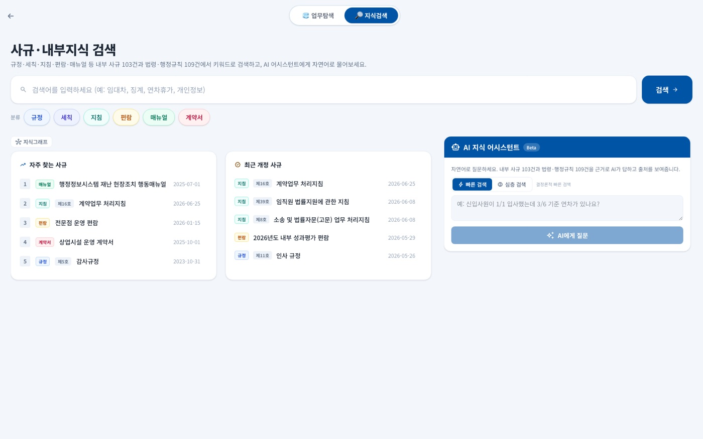

# AX Playground

> **외부 API도, 외주 계약도 없이 — 직원이 직접 지은 폐쇄망(에어갭) 생성형 AI 업무 플랫폼**

인터넷이 차단된 내부망에서, 기관이 자체 보유한 **로컬 LLM 하나만으로** 돌아갑니다. 사규 검색·문서작성·안전관리·매출분석 등 **실무 AI 기능 9종 + 관리자 콘솔**을 한 서비스로 묶고, 업무 포털 대신 **놀이공원 지도**를 첫 화면에 둬서 "AI는 어렵다"는 심리적 문턱부터 낮췄습니다.

- **폐쇄망 완결** · 외부 API·CDN 호출 0건 (폰트·wasm·모델까지 동봉/오프라인 반입)
- **무로그인** · 임직원은 로그인 없이 전 기능 사용, 관리자(`/admin`)만 키로 보호
- **빈 DB로 기동** · 데이터 없이도 앱이 뜨고, 사규·퀴즈 등은 관리자 화면에서 채웁니다
- **스택** · Next.js 16 · React 19 · TypeScript · MongoDB · 로컬 LLM(OpenAI 호환, 멀티모달) · RapidOCR · iron-session

---

## 왜 이 플랫폼인가

공공기관의 AI 도입은 보통 **보안(폐쇄망)·예산·전문인력**의 3중 제약에 막힙니다. AX Playground는 이 셋을 정면으로 풉니다.

| 제약 | 보통의 벽 | 이 플랫폼의 접근 |
|---|---|---|
| 🔒 **보안** | 외부 SaaS·API 반입 불가 | **폐쇄망 완결** — 사규·매출·민원 데이터는 내부망 로컬 AI만 접근. 외부망 신규 인프라 투자 0원 |
| 💰 **예산** | 수억 원대 SI 외주 | 직원이 AI 코딩 도구로 **직접 구현** — SW 대가산정 **기능점수(FP)** 기준 상당한 개발 가치에 해당(운영 기관 자체 산정 **≈ 5억 원**, 아래 [사례](#실제-운영-사례)) |
| 🧑‍💻 **인력** | 전담 개발자 부재 | 아이디어를 가진 **현업 직원 + AI 도구**의 짝이 개발 조직의 빈자리를 채움 |

> **핵심 차별점** — 우리 같은 공공기관이 **내부망에 로컬 모델 하나만 들이면**, ① 전 직원이 쓰는 **AX 확산 기본 업무도구**와 ② 아이디어·프롬프트·성과가 **전사에 공유·축적되는 플랫폼**이 *동시에* 생깁니다. 같은 제약을 가진 기관 어디에나 **그대로 이식**할 수 있는 모델입니다.

> **화면 요건**: 데스크톱 전용 — 최소 가로 1280px.

---

## 기능 — 공통 활용 × 업무 특화

첫 화면은 놀이공원 지도이고 **건물 하나가 기능 하나**입니다. 무로그인 즉시 입장하며, 각 기능 진입 시 **아이디어·코드 기여자의 실명**이 게임 타이틀처럼 뜹니다.

### 공통 활용 — 어느 기관에나

| 기능 | 경로 | 한 줄 소개 |
|---|---|---|
| 🏰 **AI 리터러시 리더보드** | `/quiz` | 매일 서바이벌 퀴즈·포인트·**실시간 랭킹**. 문항은 실제 업무 장면으로 출제해 놀면서 AI 기초 체력을 쌓습니다 |
| 📚 **AX 라이브러리** | `/library` | 검증된 **프롬프트·자료 도서관**(파일·투표·댓글). 흩어진 노하우를 전사 공유 자산으로 축적 |
| 🔍 **AI 지식검색** | `/panel/knowledge` | 사규·법령 **질의응답**. 하이브리드 RAG(키워드+의미+**지식그래프**) + 답변 인용을 코드가 원문과 대조하는 **인용 검증** |
| ✍️ **AI 문서작성** | `/panel/docs` | 보고서·시행문·보도자료를 **한글(hwpx)**로 자동 작성. 표준양식 6종 + 임의서식 자동 채움, **미리보기** 즉시 확인 |

### 업무 특화 — 우리 기관의 일

| 기능 | 경로 | 한 줄 소개 |
|---|---|---|
| 🦺 **스마트 안전관리** | `/panel/safety` | 현장 사진(멀티모달)으로 **위험요소 분석** — 위반사항과 근거 규정까지 |
| 📊 **AI 매출분석** | `/panel/sales` | 매장 매출 엑셀을 브라우저에서 직접 분석(서버 미저장) — 발주 우선순위·놓친 매출 진단 |
| 🖼️ **AI 광고도안심의** | `/panel/ad-review` | 도안 OCR + **내부 심의 기준 자동 대조**(무저장) |
| 📮 **AI 민원답변** | `/panel/cs-answer` | 민원 분석 + 규정에 맞는 **답변안 초안** 생성 |
| 🔬 **AI 리서치매거진** | `/panel/magazine` | 리서치 의뢰 창구 |

**공통 기반** — 로컬 경량 AI(언어·이미지) · 하이브리드 RAG · 인용 검증 게이트 · **가드레일**(입력검사→모델→출력검사→감사로그) · 관리자 콘솔. 기반이 하나라서 새 기능도 이 위에 바로 얹힙니다.

> **관리자 콘솔**(`/admin`) — 사용통계 · 가드레일 · AI답변품질 · 퀴즈 · 라이브러리 · 사규 · 광고심의 기준 · 문서양식 · 설정. 초기 데이터 입력의 대부분을 코드 수정 없이 화면에서 처리합니다.

---

## 저장소 구조

```
ax-playground/
├── src/
│   ├── app/            # 페이지 + API 라우트(app/api/*)
│   ├── components/     # 패널·공통 UI
│   ├── lib/            # guardrails·llm·ocr·db·env·regulations(RAG)·docs-generate …
│   ├── models/         # Mongoose 모델(컬렉션)
│   └── scripts/        # 적재·시드·평가 스크립트(tsx)
├── public/             # 정적 자산: fonts(오프라인)·rhwp_bg.wasm·sagyu.json·이미지
├── tools/
│   ├── hwpx/           # HWPX 빌더(순수 Python stdlib) + 양식 템플릿
│   └── ocr/            # RapidOCR 사이드카(Dockerfile·requirements·모델 동봉 레시피)
├── infra/              # nginx·Modelfile·가드레일 가이드 + offline/(폐쇄망 조립킷)
├── data/
│   ├── regulations-2026/  # 사규 원본 md (샘플 9건 동봉 — 형식 예시)
│   └── work100/sample/    # 업무탐색 3D 샘플 데이터
├── docs/               # 설치·아키텍처·가드레일·RAG 문서
├── docker-compose.yml  # 로컬 MongoDB(127.0.0.1)
└── package.json
```

## 빠른 시작 (로컬 개발)

```bash
# 1) 의존성
npm install

# 2) 환경 변수
cp .env.example .env.local
#   MONGODB_URI=mongodb://127.0.0.1:27017/axplayground
#   SESSION_SECRET=<32자 이상 랜덤>       ADMIN_ACCESS_KEY=<관리자 암호, 8자 이상>
#   OPENAI_COMPATIBLE_BASE_URL=http://127.0.0.1:11434/v1
#   OPENAI_COMPATIBLE_MODEL=<로컬 모델 이름>

# 3) MongoDB 기동 (빈 DB로 충분 — 복원할 덤프가 없습니다)
docker compose up -d          # 또는 이미 돌고 있는 mongod

# 4) 개발 서버
npm run dev                   # http://localhost:3000  ·  관리자 http://localhost:3000/admin
```

이 상태에서 화면·이동은 모두 동작합니다. **생성 기능**은 OpenAI 호환 API를 제공하는 로컬 LLM(Ollama, vLLM, llama.cpp, LM Studio, **MLX** 등)이 있어야 하고, 안전관리·광고심의는 **비전(멀티모달) 모델**이 필요합니다. 광고심의 OCR은 별도 설정이 필요합니다([`tools/ocr/README.md`](tools/ocr/README.md)).

## 초기 데이터 온보딩

빈 DB에서 시작해 아래 순서로 채웁니다. **① ~ ③은 관리자 화면(`/admin`)에서, ④ ~ ⑤는 CLI**입니다.

### ① LLM 연결 설정 — `/admin` › **설정**

가장 먼저 합니다. 모델 설정이 없으면 모든 생성 기능이 실패합니다.

1. **Base URL**(예: `http://127.0.0.1:11434/v1`)과 **API Key**(로컬 서버는 아무 값이나)를 입력하고 **모델 목록 불러오기**로 연결을 확인합니다.
2. 기능별(지식검색·매출분석·문서작성·민원답변·광고심의·안전관리·매거진·통합채팅) 사용할 모델을 고릅니다. 안전관리·광고심의는 **비전 모델**을 지정하세요.
3. **연결 테스트**로 각 모델의 응답을 확인한 뒤 저장합니다.

> 저장된 설정(DB `playground_config`)이 환경변수보다 **우선**합니다. `.env.local` 값은 폴백입니다.

### ② 사규 적재 — `/admin` › **사규**

지식검색·문서작성의 근거 데이터입니다.

- **파일로 적재**: 사규 탭에서 원본(HWP/HWPX/PDF/MD)을 올리면 추출 → 청킹 → 검수(변경분 diff) → 커밋까지 화면에서 진행됩니다. 스캔 PDF는 OCR을 거칩니다.
- **CLI로 1건 재적재**: `npm run reg:ingest -- --file <경로>` (`--dry` 로 변경분류 미리보기)
- **폴더째 전체 적재**: `data/regulations-2026/<분류>/<파일>.md` 로 넣고 `npx tsx src/scripts/import-regulations.ts --commit`
  - **첫 번째 폴더 이름이 곧 분류**입니다(`규정`·`세칙`·`지침`·`매뉴얼`·`편람`·`계약서`).
  - 형식·프런트매터 규칙과 **가상의 예시 사규 9건**이 [`data/regulations-2026/README.md`](data/regulations-2026/README.md)에 들어 있습니다. 자기 사규를 넣기 전에 이 9건으로 먼저 동작을 확인하세요.

### ③ 운영 데이터 입력 — `/admin`

| 탭 | 넣는 것 |
|----|---------|
| **퀴즈 관리** | AI 리터러시 퀴즈 문항(문제·보기·정답·해설). 리더보드가 이 풀에서 출제합니다. |
| **설정 › 공지 팝업** | 메인 진입 시 뜨는 공지(제목·본문·기간). 본문의 URL은 자동으로 링크가 됩니다. |
| **광고심의 기준** | 광고도안 심의 룰(금지 표현·필수 표기 등). 시연용 기본 룰은 `npm run seed:ad-rules`. |
| **라이브러리 관리** | 프롬프트·자료 카테고리와 초기 게시물. |
| **문서양식** | 보고서·시행문·보도자료 표준 HWPX 양식 확인·교체. |

기본 시드(공지·퀴즈 풀·프롬프트·안전 사례 등 데모 데이터)를 한 번에 넣으려면 `npm run seed`.

### ④ 사규 검색 목록 재생성

```bash
npm run sagyu:build     # DB(rag_regulation) → public/sagyu.json
```

지식검색 좌측의 사규 목록은 이 정적 JSON을 읽습니다. **사규를 적재·수정한 뒤에는 반드시 실행**하세요. (`npm run build` 에도 같은 단계가 포함돼 있습니다.)

### ⑤ 동봉 샘플 데이터(선택)

실데이터가 준비되기 전에 전 기능을 검증할 수 있도록 가상의 샘플이 동봉돼 있습니다.

| 샘플 | 위치 | 넣는 방법 |
|------|------|-----------|
| 사규 9건(분류 6종) | `data/regulations-2026/` | `npx tsx src/scripts/import-regulations.ts --commit` 후 `npm run sagyu:build` |
| 검색 검증 골드셋(20+8문항) | `data/benchmark/` | `npx tsx src/scripts/benchmark.ts --label sample` |
| 퀴즈 기본팩 200문항(기관 중립) | `scripts/quiz-seed-data.json` | `npm run seed:quiz` |
| 퀴즈 CSV 형식 예시 20문항 | `data/samples/quiz-sample.csv` | `/admin` › **퀴즈 관리**에서 업로드 |
| 라이브러리 초기 게시물 | 시드 스크립트 | `npm run seed:library-sample` |
| 업무탐색 3D 샘플 | `data/work100/sample/` | `npm run seed:work-sample` (`--dry` 검증만 · `--clean` 샘플만 제거) |
| 광고심의 예시 룰셋(가상 4업종) | `src/scripts/ad-rules-data.ts` | `npm run seed:ad-rules` |
| 안전수칙 샘플 10건(일반 사업장) | `src/data/safety/safety-qa.json` | 빌드 시 자동 로드 |

> ⚠️ **광고심의 룰셋·안전관리 안전수칙은 각 기관의 내부 데이터 자산입니다.** 동봉된 것은 기능 검증용 **중립 예시**일 뿐, 실제 심의 기준이나 안전 지식이 아닙니다(광고 룰의 근거 조문 번호도 가상). 도입 기관은 관리자 화면(광고심의 기준)·`safety-qa.json`을 **자기 기관의 실제 기준으로 교체**해 사용하세요.

검증이 끝나면 같은 경로·같은 방법으로 자기 기관 데이터로 교체하면 됩니다. 처음 도입하는 기관을 위한 단계별 안내는 **[타기관 도입 가이드](docs/ADOPTION_GUIDE.md)** 에 있습니다.

### 외부 법령·행정규칙 수집(선택)

사규가 인용하는 상위 법령을 같이 검색하려면 **법제처 국가법령정보 오픈API**로 직접 수집합니다. 데이터는 동봉되지 않으며, 수집에는 **인터넷과 법제처에서 발급받은 OC(기관코드)**가 필요합니다.

```bash
# [인터넷 되는 머신] 원문 수집 → md 변환
LAW_OC=<발급받은 OC> node src/scripts/fetch-external-laws.mjs   # → data/laws/raw/*.json
node src/scripts/convert-laws-to-md.mjs                        # → data/laws/md/*.md

# [적재] 파일명 접두어가 곧 분류: 법령_*.md / 행정규칙_*.md
npm run laws:ingest            # --dry 청킹만 미리보기 · --force 무변경도 재적재
```

폐쇄망에서는 수집 단계를 돌릴 수 없으므로, 개발망에서 만든 `data/laws/md/` 만 반입해 `npm run laws:ingest` 를 실행합니다. 외부 규범은 사내 사규와 **검색이 격리**되고 임베딩·그래프 대상이 아니므로, 임베딩 서버 없이도 적재됩니다.

## 폐쇄망(운영) 배포

대용량·플랫폼 의존 바이너리(Node·`node_modules`·MongoDB·OCR 런타임)는 **인터넷 되는 머신에서 조립해 반입**하고, 폐쇄망에서는 스크립트로 **설치만** 합니다. LLM과 모델은 이미 폐쇄망에 탑재돼 있다는 전제로 **연결만** 합니다.

> 📦 **OS별 반입·설치 통합 가이드 — 먼저 여기서 트랙 선택**: [`infra/offline/README.md`](infra/offline/README.md)

**① Ubuntu 24.04 / ② Windows WSL2(Ubuntu 24.04)** — 같은 리눅스 번들·스크립트:
```bash
bash infra/offline/fetch-offline-bundle.sh    # [연결된 amd64 머신] infra/offline/bundle/ 생성 → 반입
bash infra/offline/install-offline.sh         # [폐쇄망] 설치 → .env.local 작성 → npm run dev
```
가이드: [`docs/OFFLINE_INSTALL.md`](docs/OFFLINE_INSTALL.md)

**③ 네이티브 Windows(WSL 없이)** — Windows용 번들·PowerShell:
```powershell
powershell -ExecutionPolicy Bypass -File infra\offline\fetch-offline-bundle.ps1
# node_modules 는 Windows에서: npm ci ; Compress-Archive -Path node_modules -DestinationPath infra\offline\bundle-win\node_modules-win.zip
powershell -ExecutionPolicy Bypass -File infra\offline\install-offline.ps1
```
가이드: [`docs/OFFLINE_INSTALL_WINDOWS.md`](docs/OFFLINE_INSTALL_WINDOWS.md)

인프라 가드레일(nginx·감사로그·cron): [`infra/README.md`](infra/README.md)

## 다중 사용자 운영(동시성)

**단일 인스턴스(수직 확장)** 전제로 하드닝돼 있습니다. 병목은 **단일 LLM 서버**이므로 LLM·서브프로세스 호출에 전역 동시성 상한(세마포어)을 두고, 과부하 시 호스트가 죽는 대신 **빠르게 503/429로 거절**합니다(백프레셔). 그 밖에 DB 인덱스 자동 생성·커넥션 풀 상향(50)·감사 비동기화·per-user(`ax_anon` 쿠키) rate-limit·atomic 카운터·업로드 디스크 가드·관리자 통계 `$facet` 집계가 들어 있습니다.

| 변수 | 기본 | 변수 | 기본 |
|------|------|------|------|
| `LLM_MAX_CONCURRENCY` | 8 | `SUBPROC_MAX_CONCURRENCY` | 4 |
| `LLM_MAX_QUEUE` | 24 | `SUBPROC_MAX_QUEUE` | 12 |
| `LLM_TIMEOUT_MS` | 180000 | `LLM_MAX_RETRIES` | 1 |

**배포 요건**: 단일 인스턴스 기동 · 리버스 프록시 real-IP 포워딩 · go-live 전 인덱스 생성 확인 · 업로드/DB/감사 디스크 여유. 상세: [`docs/SCALE_HARDENING.md`](docs/SCALE_HARDENING.md) · [`docs/CONCURRENCY_REVIEW.md`](docs/CONCURRENCY_REVIEW.md)

## 주요 스크립트

| 명령 | 설명 |
|------|------|
| `npm run dev` / `build` / `start` | 개발 / 빌드(사규 JSON 생성 포함) / 운영 |
| `npm run seed` | 데모 기본 시드(공지·퀴즈·프롬프트·안전 사례 등) |
| `npm run seed:quiz` | 퀴즈 기본팩 200문항(기관 중립) 적재 |
| `npm run seed:work-sample` | 업무탐색 3D 샘플(가상 조직 온톨로지 + 업무 흐름 보드 10건). `--dry` · `--clean` |
| `npm run seed:ad-rules` / `seed:library-sample` | 광고심의 기준 룰 / 라이브러리 초기 게시물 시드 |
| `npm run reg:ingest -- --file <경로>` | 사규 1건 적재·재적재(관리자 UI 커밋과 동일 경로). `--dry` 변경분류 미리보기 |
| `npx tsx src/scripts/import-regulations.ts` | `data/regulations-2026` 폴더째 적재. `--dry-run` · `--commit` · `--sagyu` |
| `npm run sagyu:build` | DB → `public/sagyu.json` 재생성 |
| `npm run laws:ingest` | `data/laws/md/*.md`(법제처 수집분) 적재. `--dry` · `--force` |
| `npx tsx src/scripts/benchmark.ts --label X` | 검색 품질 벤치마크(유형별 A/B) |
| `npm run test:guardrails` / `lint` | 가드레일 단위 테스트(PII·인젝션·시스템 프롬프트) / ESLint |

## 문서

전체 목록은 [`docs/README.md`](docs/README.md). 핵심:
**[타기관 도입 가이드](docs/ADOPTION_GUIDE.md)** ·
[폐쇄망 배포 허브](infra/offline/README.md) · [설치(Ubuntu/WSL2)](docs/OFFLINE_INSTALL.md) ·
[설치(Windows)](docs/OFFLINE_INSTALL_WINDOWS.md) · [아키텍처 도식](docs/ARCHITECTURE.md) ·
[프로젝트 개요(상세)](docs/PROJECT_OVERVIEW.md) · [사규 하이브리드 RAG](docs/RAG_GRAPHRAG.md) ·
[가드레일 매핑](docs/guardrail-mapping.md) · [지식그래프 스키마](docs/GRAPH_SCHEMA.md)

## 실제 운영 사례

이 플랫폼은 **코레일유통(주) AI혁신처**가 폐쇄망에서 실제 운영 중이며, 이 저장소는 그 운영본에서 기관 고유 데이터·브랜딩을 걷어낸 **중립 공개판**입니다. 관리자 설정에서 기관명을 넣고 데이터를 적재하면 어느 기관이든 같은 모습으로 띄울 수 있습니다.

- **개시 6주 실측** — 접속 1,767회 · 기능 진입 1,273회 · 주요기능 실행 815회. 진입 1위가 업무 기능이 아니라 **퀴즈(557회)**로, 놀러 들어온 직원이 지식검색까지 써보는 자연 유입 경로가 작동했습니다.
- **품질 지표(자체 100문항 시험)** — 답변 인용률 70→**87%**, 범위 밖 질문 거절률 1→**63%**, 검색 회수율 69.6→**77.2%**.
- **개발 가치(자체 산정)** — 실제 소스코드(API 92개 기본프로세스 · 데이터 논리파일 23개)를 **기능점수(FP)**로 분해해 「SW사업 대가산정 가이드(2025)」 정통법으로 추정: **UFP 604점 × 605,784원 ≈ 개발비 5.03억 원**(직접비만 반영한 보수적 값).
- **직원이 직접** — 사내 아이디어 경진대회 수상작(스마트 안전관리)이 실제 기능으로 탑재됐고, 모든 기능 진입 화면에 아이디어·코드 기여자의 **실명**이 게임 타이틀처럼 표출됩니다. 외주 산출물이 아니라 **조직의 역량**이 쌓입니다.


*메인 이미지맵 — 실제 운영 인스턴스 화면(데이터는 해당 기관 것)*


*AI 지식검색(사규 하이브리드 RAG) — 실제 운영 인스턴스 화면(데이터는 해당 기관 것)*

## 참고·감사 — 공공 AX는 서로 참고하며 자랍니다

이 플랫폼은 여러 공공부문 오픈소스·선행 사례에 기대어 만들어졌습니다. 폐쇄망 공공 AX는 **서로 공유하고 참고하며 결과물을 함께 키우는 것**이 핵심이라, 도움받은 곳을 분명히 밝힙니다.

| 구성요소 | 역할 | 만든 곳 |
|---|---|---|
| **kordoc** | 한글(hwpx)·PDF·Office **문서 파싱**(텍스트·표 추출·청킹) — 사규 적재와 문서작성 전 과정의 근간 | **광진구청 류 주임** |
| **rhwp** (`public/rhwp_bg.wasm`) | 한글(hwpx) **문서 미리보기** 렌더(브라우저 wasm) — 생성한 공문서를 즉시 눈으로 확인 | **rhwp** |
| **korea100studio / 제도100** | **업무 프로세스 보드(스윔레인)** 생성·검증·렌더 — '업무탐색'의 절차 시각화 | **행정안전부 서호성 사무관** ([hosungseo/korea100studio](https://github.com/hosungseo/korea100studio)) |
| **public-doc-to-hwpx** | 공공문서 표준 hwpx 빌드 파이프라인(1p·풀버전·시행문·보도자료) | **자작 스킬** — 본 프로젝트 작성자 자체 제작 |

특히 **kordoc(문서 파싱)** 과 **rhwp(문서 미리보기)** 가 없었다면 'AI 문서작성'의 한글 공문서 흐름은 성립하지 못했고, **제도100의 보드 렌더러**가 '업무탐색'의 프로세스 시각화를 가능하게 했습니다. 세 분(팀)의 공유에 깊이 감사드립니다.

## 라이선스

이 저장소의 소스 코드는 **MIT License** 입니다 — [`LICENSE`](LICENSE).
Copyright (c) 2026 Korail Retail Co., Ltd.

동봉된 서드파티 구성요소는 각자의 라이선스를 따릅니다.

| 구성요소 | 라이선스 |
|----------|----------|
| `public/fonts/NotoSansKR-*.woff2` (Noto Sans KR) | SIL Open Font License 1.1 — [`public/fonts/OFL.txt`](public/fonts/OFL.txt) |
| `public/fonts/MaterialSymbolsOutlined.ttf` (Material Symbols) | Apache License 2.0 — [`public/fonts/LICENSE-Apache-2.0.txt`](public/fonts/LICENSE-Apache-2.0.txt) |
| `vendor/korea100studio/` | MIT — [`vendor/korea100studio/LICENSE`](vendor/korea100studio/LICENSE) |
| `reference/public-doc-to-hwpx/` | MIT — [`reference/public-doc-to-hwpx/LICENSE`](reference/public-doc-to-hwpx/LICENSE) |

`data/regulations-2026/` 의 사규 9건과 `data/work100/sample/` 의 조직 데이터, `public/sales-guide`·`public/market` 의 안내 이미지, `tools/hwpx/templates/format_press/standard.hwpx` 의 담당자 정보는 모두 **가상의 예시**이며 실제 기관의 문서·데이터가 아닙니다. "코레일유통", "KORAIL" 등의 표장은 각 권리자의 상표로, MIT 허여 범위에 포함되지 않습니다.
