# 동작 구조 (아키텍처)

AX Playground의 패널별 동작 구조와 공통 인프라를 도식으로 정리한다. 다이어그램은 Mermaid(깃허브 렌더)다.

- **앱**: Next.js 16 App Router — `src/app`(페이지 + `app/api/*` 라우트), `src/components`(UI), `src/lib`(서비스), `src/models`(Mongoose).
- **외부 연동 없음**: 모든 생성은 내부망 로컬 LLM, 모든 LLM 호출은 가드레일 게이트웨이 경유.
- **저장소**: MongoDB `axplayground`. 패널별로 쓰는 컬렉션은 각 절에 표기.

---

## 1. 시스템 개요

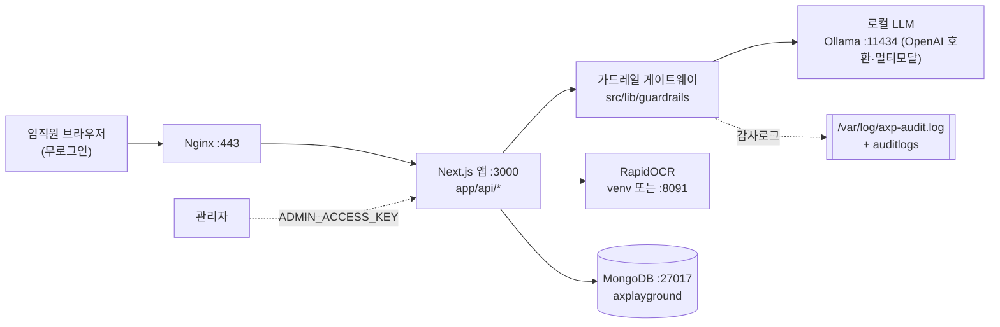

요청은 **페이지 → API 라우트 → 서비스(lib) → (가드레일)LLM / OCR / Mongo** 순으로 흐른다. 생성형 패널은 모두 `guardedChat()`를 거친다.

## 2. 공통 요청 파이프라인 (생성형 패널)

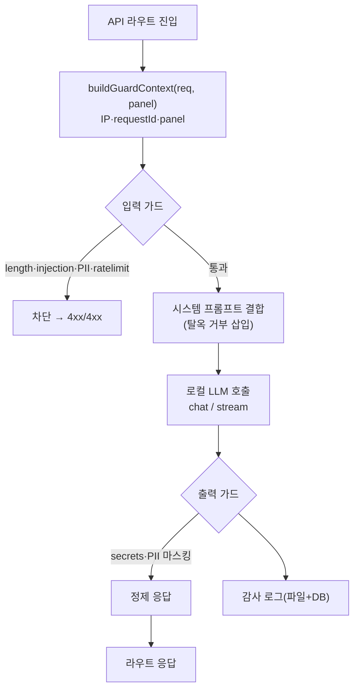

| 단계 | 모듈 | 규칙 |
|------|------|------|
| 입력 길이 | `guardrails/input/length.ts` | `maxInputChars`(기본 8000) 초과 차단 |
| 레이트리밋 | `guardrails/input/ratelimit.ts` | IP·윈도우 한도 초과 429 |
| 인젝션 | `guardrails/input/injection.ts` | 임계값 이상 400 |
| 입력 PII | `guardrails/input/pii.ts` | 주민·카드·계좌 등 검출 403 |
| 시스템 프롬프트 | `guardrails/model/system-prompt.ts` | 탈옥 거부·약관 삽입 |
| 출력 시크릿/PII | `guardrails/output/secrets.ts`·`pii-mask.ts` | 악성 패턴 차단·PII 마스킹 |
| 감사 | `guardrails/output/audit.ts` | 입·출력·차단 기록(파일 JSONL + `auditlogs`) |

진입점: `guardedChat(options)` / 스트림 변형. 컬렉션 `guardconfigs`(설정)·`guardratelimits`(윈도우)·`auditlogs`(기록).

---

## 3. 패널별 동작 구조

### 1) AI 리터러시 리더보드 — `/quiz`
페이지 `src/app/quiz/page.tsx` · 컴포넌트 `components/quiz/QuizGame.tsx` · 컬렉션 `quizpools`·`quizrankings` · LLM **미사용**.

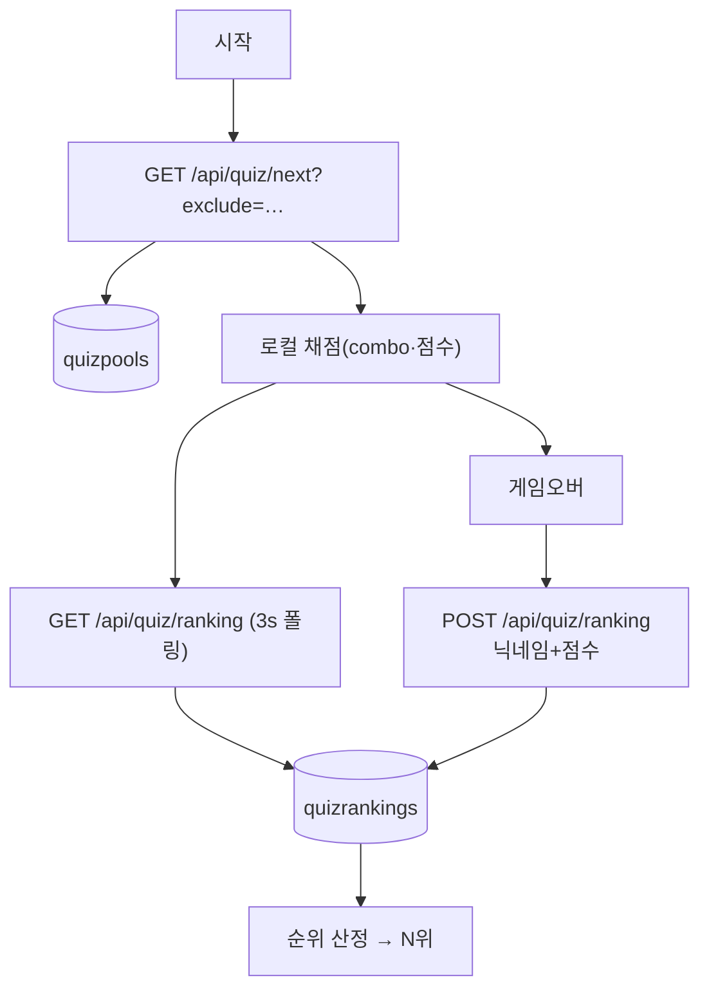
핵심: 문제 풀이(로컬 채점) + 실시간 랭킹 폴링 + 최종 점수 등록·순위.

### 2) AX 라이브러리 — `/library`
페이지 `src/app/library/page.tsx` · `components/library/*` · 컬렉션 `libraryposts` · LLM **미사용** · 파일 업로드(`lib/upload.ts`).

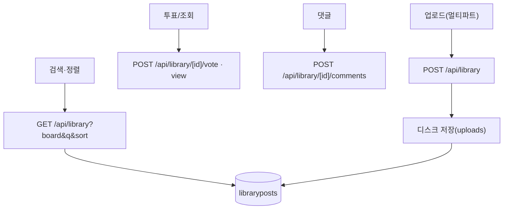
핵심: 게시물 검색/정렬 + 파일·조회·좋아요·댓글(비밀번호 또는 관리자 인증).

### 3) AI 지식검색 — `/panel/knowledge`
페이지 `src/app/panel/knowledge/page.tsx` · `components/panels/desktop/PanelKnowledge.tsx` · 컬렉션 `rag_regulation`·`rag_vectors`·`rag_graph_edges` · **LLM + 사규 하이브리드 RAG(키워드·의미·그래프)**. 상세: **[RAG_GRAPHRAG.md](RAG_GRAPHRAG.md)**.

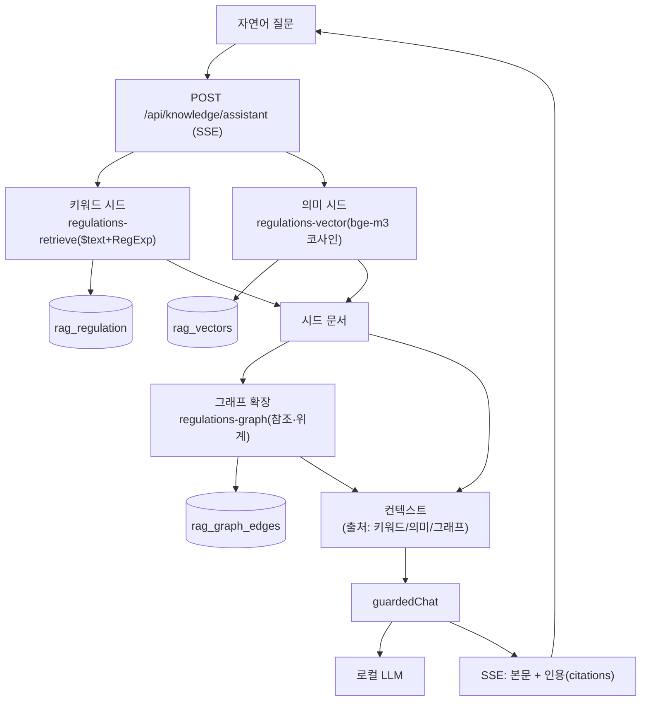
핵심: AI 질의는 **3신호 하이브리드** — 키워드($text)+의미(bge-m3 임베딩 코사인)로 시드 회수 후, 시드의 질의관련 청크가 참조하는 다른 규정·별표를 **그래프(`rag_graph_edges`)로 확장**해 컨텍스트에 출처 표식과 함께 주입. **빠른/심층 2모드**, 위계 순 정렬, 「규정명」 인용. 의미/그래프는 관리자 설정으로 on·off(Ollama 임베딩 미가동 시 자동으로 키워드만). 좌측 "지식그래프" 토글로 cytoscape 그래프 표출(답변 시 근거 강조). 좌측 키워드 검색은 클라이언트에서 `public/sagyu.json`을 직접 필터(API/DB 미경유).

**사규 적재 파이프라인** — 원본 `data/regulations-2026/`(6분류 계약서·규정·매뉴얼·세칙·지침·편람의 HWP·PDF·정제 md) → `src/scripts/import-regulations.ts`(파일 수집·모드) → 파싱·적응형 청킹(`src/lib/regulations-ingest.ts`, 관리자 적재와 공용) → `rag_regulation`(103건 / 4,819청크). 청킹은 **제N조(JO)·번호 위계(NUM)·제N장·절(JANG)·페이지(PAGE) 적응 선택 + 별표(【】·〔〕·［］ 괄호 포함) 개별 분리 + 부칙 단일 청크**이며, 분류별 전용 전략을 둔다: **계약서**는 표지+본문(조/장)+부속서류 그룹(`chunkContract`), **매뉴얼**은 표지·제개정이력·목차 색인 제외 + 부속서류(별지/양식/별첨) 격리 + 본문 위계 청킹(조 비활성) + 스캔본은 프런트매터 `청킹: 페이지`로 페이지단위(`chunkManual`). 좌측 키워드용 `public/sagyu.json`은 `import-regulations --sagyu`(파일 기반) 또는 `npm run build`가 생성한다.

### 4) AI 매출분석 — `/panel/sales` (허브 → 2패널)
진입 시 허브(`PanelSalesHub`)에서 **편의점 매출 비교** / **업종별 매출트렌드** 선택. 두 도구 모두 **엑셀을 브라우저에서 직접 분석**(원본 서버 미전송) · **DB 저장 없음**.
페이지 `panel/sales/page.tsx`(허브) · `panel/sales/compare`(`PanelSalesUpload`) · `panel/sales/trend`(`PanelSalesTrend`). 로직 `lib/salesAnalysis.ts`·`lib/marketAnalysis.ts`·`lib/marketJeonmun.ts`(xlsx) · 차트 chart.js.

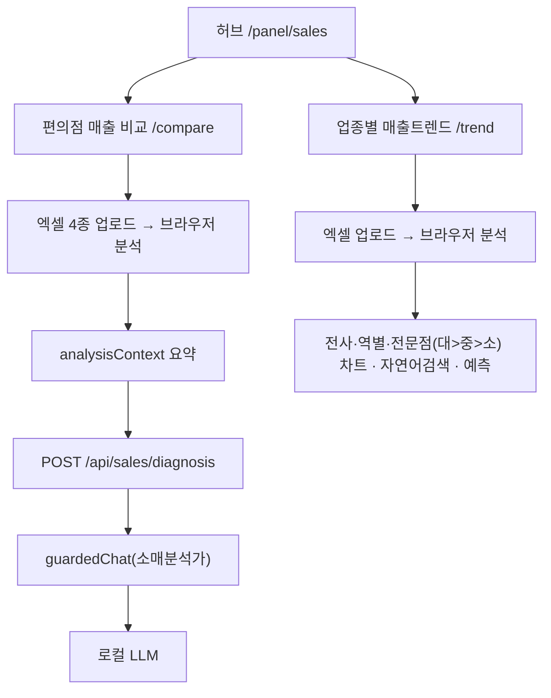
핵심: 편의점 비교는 브라우저 분석 후 **요약 텍스트만** 가드 경유 LLM 진단. 트렌드는 **완전 클라이언트**(LLM 없음)로 업종·역·전문점 매출 시각화.

### 5) AI 문서작성 — `/panel/docs`
페이지 `src/app/panel/docs/page.tsx` · `PanelDocs.tsx` · **LLM + HWPX 도구체인(kordoc·@rhwp/core·Python 빌더)** · DB 저장 없음(생성 후 다운로드).

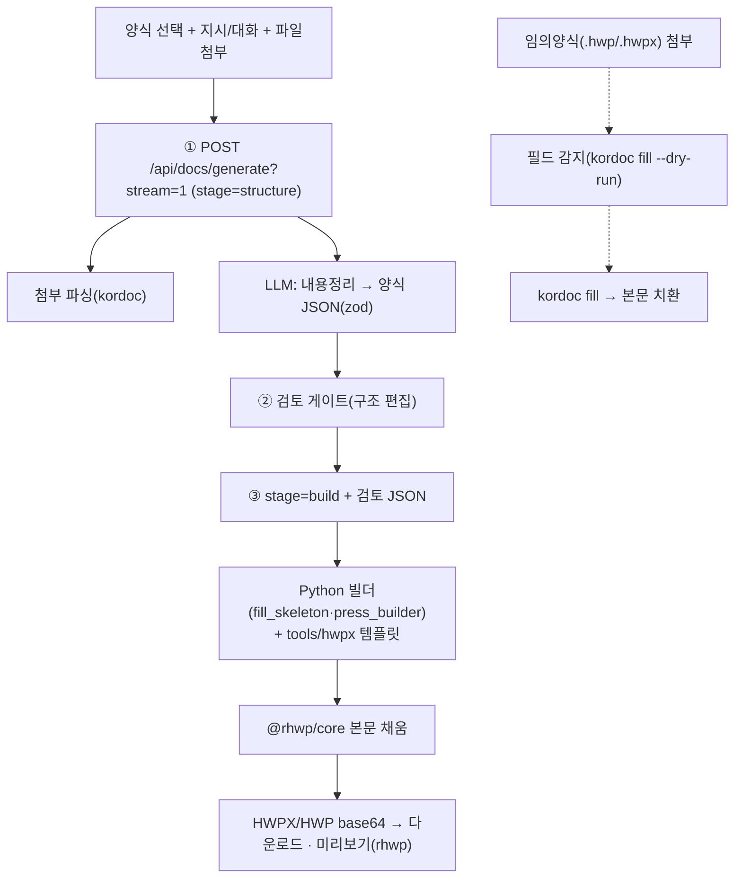
핵심: (구조 생성 LLM) → 검토 → (Python+HWPX 템플릿 빌드) → 다운로드. 임의양식은 폼필러(필드 감지→채움). 양식: 1p·풀버전·시행문·보도자료·이메일·임의.

**AI 사이드챗**(`/api/ai/chat`) — 멀티턴 + "사규 우선·일반지식 보완" 라우팅:
- **사규 근거**: 지식검색 *빠른검색과 동일 파이프라인*(`regulations-search.ts` 공유 — 재랭킹 3신호·의미 시드보강·그래프 확장·벡터 조문힌트). 짧은 후속질문("근거 조문은?")은 직전 질문과 결합해 검색.
- **첨부 문서**: `/api/ai/chat/attach`로 업로드 시 1회 인덱싱(전문 추출→**가드 전수검사**→소형은 전문/대형(≤30만자)은 청킹+bge-m3, TTL 24h 캐시) → 턴마다 **질문 맞춤 발췌**(top-k+밀도창, 요약형 질문은 구조 스킴). 스캔 PDF는 **'OCR로 읽기' 동의 버튼** 후 RapidOCR.
- **게이트**: 8,000자 입력 게이트는 **타이핑한 신규 입력만** 검사(첨부는 업로드 시 전수검사, 이전 턴은 기검사) — 멀티턴·대용량 첨부가 게이트에 막히지 않음. 12메시지 초과 시 오래된 턴 **롤링 요약**. UI: 입력 예산 미터·발췌 반영 배지(`contextMeta`).

### 6) 스마트 안전관리 — `/panel/safety`
페이지 `src/app/panel/safety/page.tsx` · `PanelSafety.tsx` · 로직 `lib/safety-rag.ts`(안전 Q&A **107건** 키워드검색 그라운딩, `src/data/safety/safety-qa.json`) · 컬렉션 `safetyarticles`(게시판) · **멀티모달 LLM(비전)** · OCR 미사용·이미지 무저장.

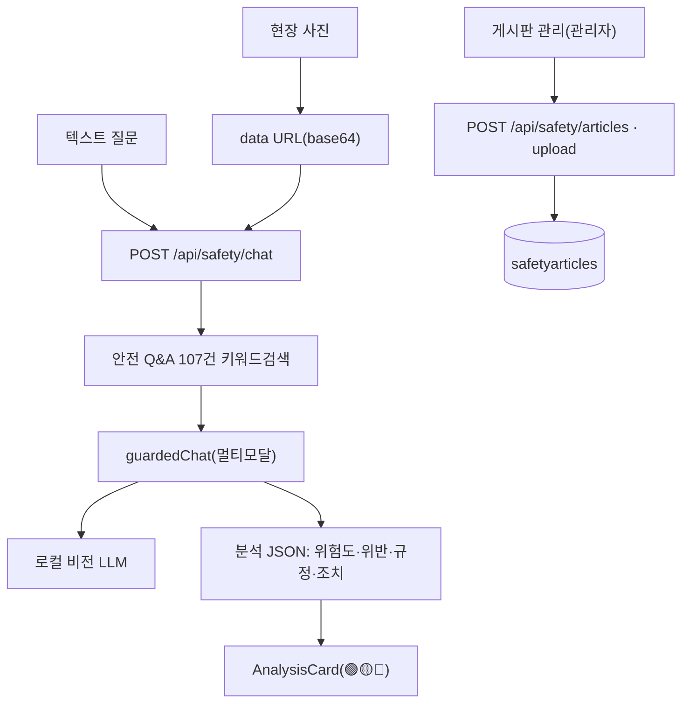
핵심: 사진(또는 텍스트) → **안전 Q&A 107건 근거 주입** → 가드 경유 비전 LLM → 위험도/조치 체크리스트(JSON). 이미지는 메모리 전송만. FAQ는 랜덤 카드로 노출.

### 7) AI 민원답변 — `/panel/cs-answer`
페이지 `src/app/panel/cs-answer/page.tsx` · `PanelCsAnswer.tsx` · 로직 `lib/cs/voc-analytics.ts`(2024·2025 전사 VOC 집계 그라운딩, `src/data/cs/voc-aggregates.json`) · 컬렉션 `featureusages`(사용량)·`auditlogs` · **LLM(텍스트)**.

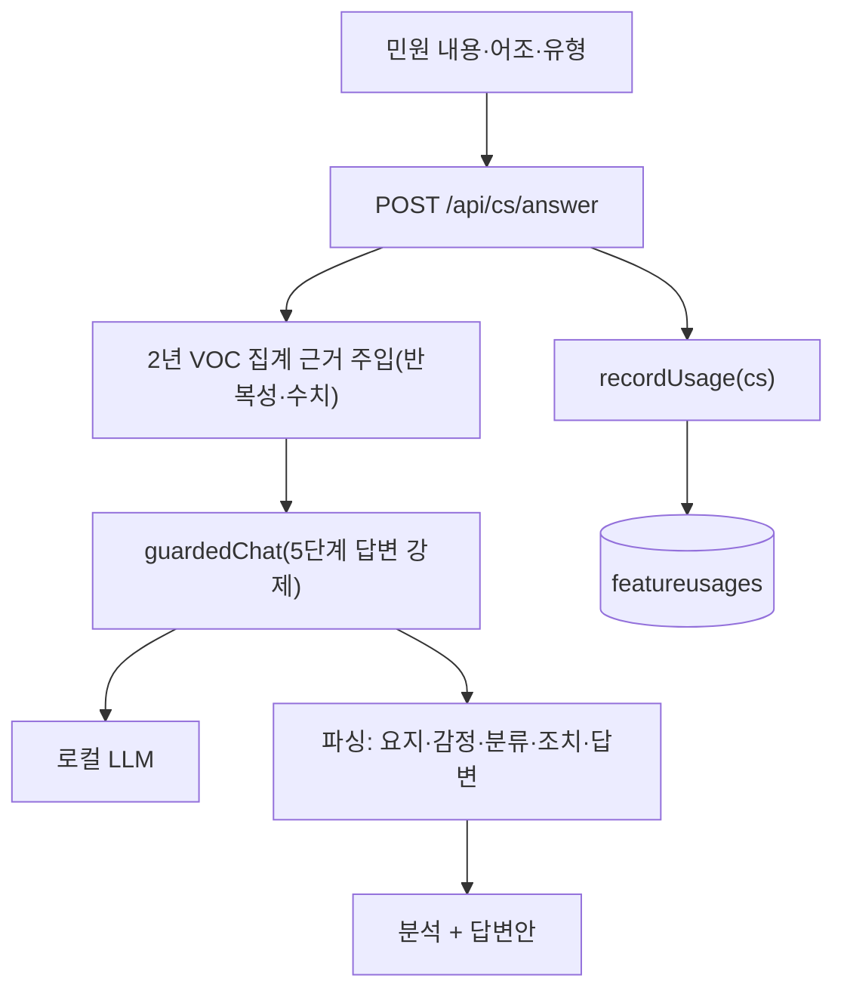
핵심: 민원 분석(감정·분류 + **2년 전사 집계 기반 반복성·수치 진단**) + CS 5단계 원칙(사과→공감→확인→조치→인사) **공식 답변양식** 생성. 접수채널 입력은 제거됨.

### 8) AI 광고도안심의 — `/panel/ad-review`
페이지 `src/app/panel/ad-review/page.tsx` · `PanelAdReview.tsx` · 컬렉션 `adindustryrules`·`adreviewcriterias` · **OCR + 룰 + 멀티모달 LLM** · 결과 무저장.

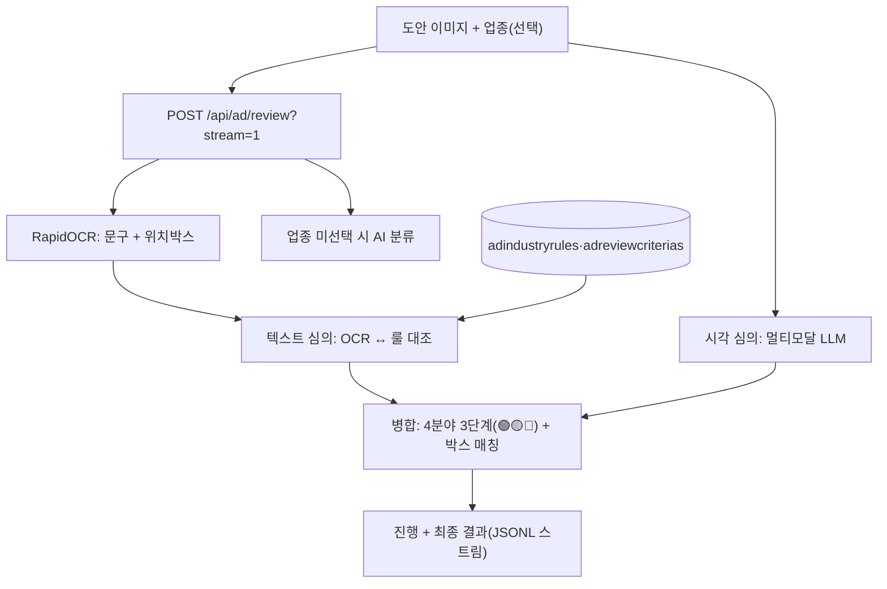
핵심: OCR(문구+박스) + 업종룰 대조(텍스트) + 멀티모달(시각) **병렬 심의** → 4분야 3단계 판정. 저장 안 함.

### 9) AI 리서치매거진 — `/panel/magazine`
페이지 `src/app/panel/magazine/page.tsx` · `PanelMagazine.tsx` · **정적**(API·DB·LLM 없음). 인사이트허브 안내 이미지 + QR. 스플래시 소개만 "리서치 의뢰" 컨셉.

### 10) 관리자 — `/admin`
페이지 `src/app/admin/page.tsx`(+`/admin/guardrails`) · `components/admin/*` · `lib/adminAuth.ts`·`session.ts` · 다수 설정 컬렉션.

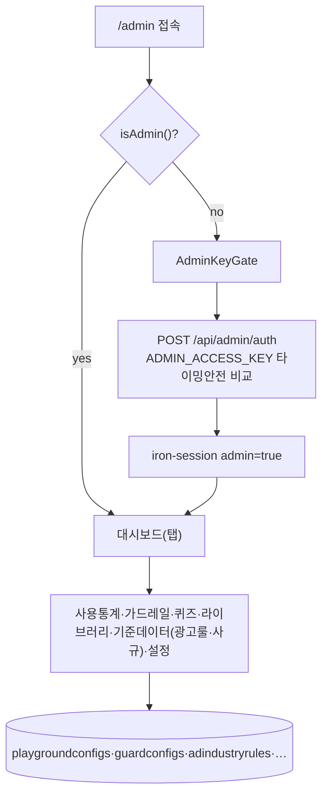
핵심: 키 인증(env 또는 DB 해시) → 6탭 통합 관리(설정·가드레일·콘텐츠·기준데이터) + 사용통계. 사규 적재 탭은 **업로드 → 미리보기(추출·청킹·자가검수, 스캔 PDF 자동 OCR) → 적재(commit)**로 `rag_regulation` 갱신 후 `public/sagyu.json`을 즉시 재생성(`POST /api/admin/regulations/ingest`).

---

## 4. 공통 인프라 모듈

| 영역 | 파일 | 요점 |
|------|------|------|
| 세션/인증 | `src/lib/session.ts`·`adminAuth.ts` · `app/api/admin/auth` | 임직원 무로그인. 세션엔 `admin` 플래그만(iron-session 쿠키 `ax_portal_session`). 관리자키는 env 또는 DB 해시 |
| 가드레일 | `src/lib/guardrails/*` | §2 파이프라인. `guardedChat`이 단일 진입점 |
| DB | `src/lib/db.ts`·`env.ts` | `connectDb()` 싱글톤. `dbName = MONGODB_DB || "axplayground"`(URI 경로보다 우선) |
| LLM | `src/lib/llm.ts` | `resolveLlmTarget(feature)` → DB 기능별 모델 → env 폴백. `chatLlm`/`streamChatLlm`(OpenAI 호환) |
| OCR | `src/lib/ocr.ts` | `OCR_PROVIDER` = python(기본)·http·none. 임시파일→Python→삭제(무저장), 실패 시 graceful |
| RAG(하이브리드) | `regulations-retrieve.ts`(키워드)·`regulations-vector.ts`(의미)·`regulations-graph.ts`(그래프)·`regulations-graph-build.ts`(증분) | `$text`+RegExp 키워드 + bge-m3 임베딩 코사인 + 그래프 확장. 상세 [RAG_GRAPHRAG.md](RAG_GRAPHRAG.md) |
| 사규 적재 | `src/lib/regulations-ingest.ts`(청킹)·`regulations-extract.ts`(추출) · 스크립트 `src/scripts/import-regulations.ts` | `data/regulations-2026/` → 적응형 청킹 → `rag_regulation`. 관리자 적재 API와 청킹 공용. 추출: txt/md 직접, hwp·hwpx·pdf·docx는 kordoc, 스캔 PDF는 OCR(`tools/ocr/ocr_pdf.py` = RapidOCR PP-OCRv5 + PyMuPDF 래스터화) 자동 승격 |
| 사용량 | `src/lib/usage.ts` | `recordUsage(feature)` fire-and-forget → `featureusages` |

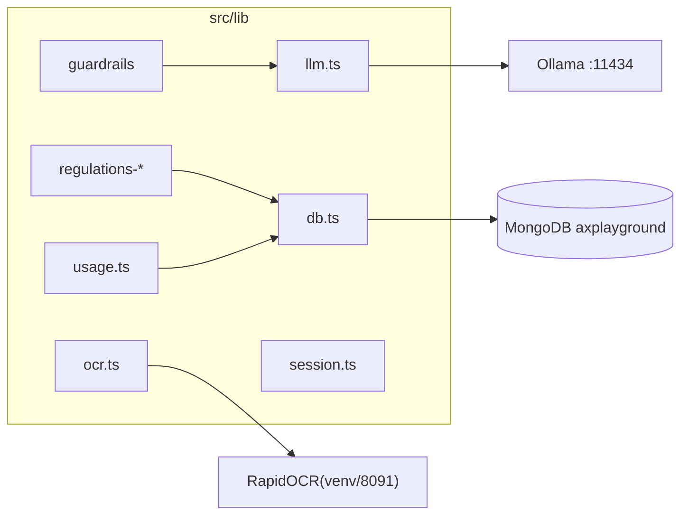

## 5. 데이터 모델 (주요 컬렉션)

| 컬렉션 | 모델 | 쓰는 패널 |
|--------|------|-----------|
| `rag_regulation` | RagRegulation | 지식검색·관리자 (사규 103건/4,787청크, `data/regulations-2026` 적재) |
| `quizpools`·`quizrankings`·`quizlogs` | QuizPool·QuizRanking·QuizLog | 리더보드·관리자 |
| `libraryposts` | LibraryPost | 라이브러리·관리자 |
| `salesorders` | SalesOrder | (구 매장분석 발주 · 현재 미사용) |
| `safetyarticles` | SafetyArticle | 안전관리 |
| `adindustryrules`·`adreviewcriterias` | AdIndustryRule·AdReviewCriteria | 광고심의·관리자 |
| `prompts` | Prompt | 라이브러리·관리자 |
| `playgroundconfigs`·`guardconfigs` | PlaygroundConfig·GuardConfig | 관리자·가드레일 |
| `featureusages`·`auditlogs`·`guardratelimits` | FeatureUsage·AuditLog·GuardRateLimit | 공통(런타임) |
| `notices`·`resources`·`vocitems`·`lawconsults`·`pressreleases` | — | 공지·자료·CS·법률·보도자료 |

> 런타임 누적(`auditlogs`·`guardratelimits`·`*logs`·`featureusages`)은 시드 덤프에서 제외된다([`../data/mongo-snapshot/README.md`](../data/mongo-snapshot/README.md)).
